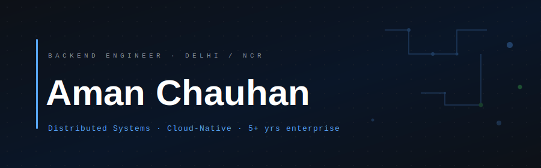
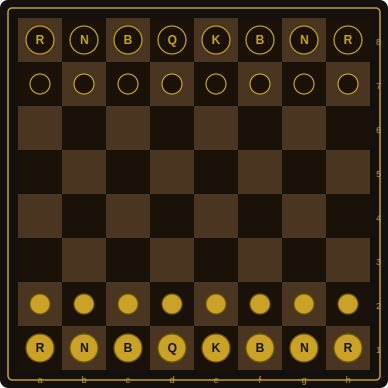

  

  &nbsp;
  &nbsp;
  &nbsp;
  

  

 

---

### ♟ OPENING

Backend-heavy generalist. I design systems the way I play chess — thinking several moves ahead, building positions that hold under pressure, not just solving for what's in front of me.

Where I add leverage: high-concurrency backends, event-driven architectures, and data layers built to outlast the opening and win the endgame.

---

### ♟ ACTIVE GAME

- Building a **family health record vault** — Flutter + NestJS + Gemini AI for OCR, auto-tagging, and smart reminders
- Preparing for **AWS SAA-C03** — formalizing what I've been executing in practice
- Digging into AI/ML integration patterns for production backend systems

---

### ♟ PIECE SET

  

---

  
   
  ♟ &nbsp; White to move &nbsp; ♟

---

### ♟ TOURNAMENT RECORD

<table width="100%">
  <tr>
    <td valign="top" width="50%">
      <h4>Property management platform</h4>
      Backend for 12k+ DAU. High-concurrency scheduling, complex visit workflows, built to handle load without degradation.
    </td>
    <td valign="top" width="50%">
      <h4>Stock market matching engine</h4>
      Custom engine using TimescaleDB + Cassandra for hyper-efficient time-series reads/writes at scale. <a href="https://geekyants.com/blog/developing-a-stock-market-app-backend/">wrote about it →</a>
    </td>
  </tr>
  <tr>
    <td valign="top" width="50%">
      <h4>WhatsApp automation infra</h4>
      Twilio + WhatsApp Flow JSON handling hundreds of daily networking calls, zero manual intervention post-call.
    </td>
    <td valign="top" width="50%">
      <h4>Monolith → microservices migration</h4>
      Led the architectural shift from NestJS to Java Spring Boot, with fault-tolerance and maintainability as hard constraints.
    </td>
  </tr>
</table>

---

### ♟ APPROACH

> Good architecture is positional, not reactive. I design for where a system needs to be in 18 months — not for the move in front of me.

Every API contract, data model, and service boundary is a decision that should open up better positions down the line. I learned that from chess. It applies everywhere.

**Tools I live in:** NestJS · Prisma · Docker · Azure · Kubernetes · git

---

### ♟ OFF THE BOARD

Royal Enfield on Delhi roads &nbsp;·&nbsp; doubles badminton &nbsp;·&nbsp; positional chess (obviously) &nbsp;·&nbsp; Jaun Elia & Ghalib &nbsp;·&nbsp; the occasional late-night chess.com grind

 

---

  Built like a positional game — every element placed with intent. &nbsp; ♟ &nbsp; June 2026 · Delhi/NCR

