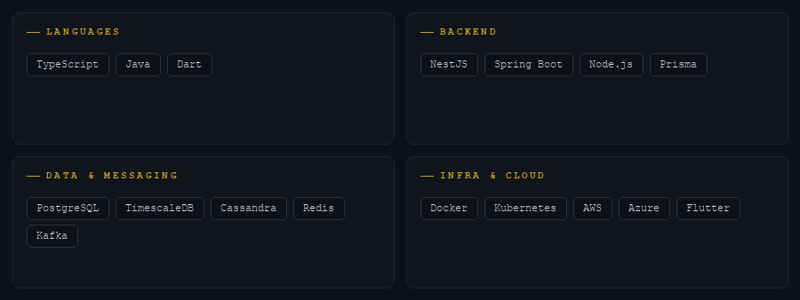
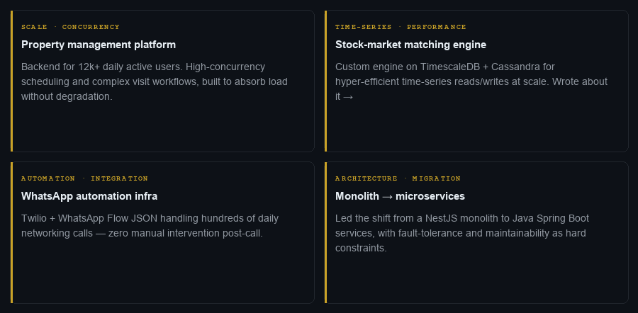

  &nbsp;
  &nbsp;
  &nbsp;
  

  

  

## Position

I build backend systems the way strong players build positions — several moves ahead, under pressure, and designed to hold. The interesting work isn't the move in front of you; it's the structure that quietly wins the endgame.

My leverage is in the parts that have to survive scale: **high-concurrency services**, **event-driven architecture**, and **data layers built to outlast the opening**. I care about the boring guarantees — correctness under load, graceful failure, and systems that don't page you at 3am.

## On the board now

- Architecting a **family health-record vault** — Flutter + NestJS, with Gemini for OCR, auto-tagging, and intelligent reminders
- Earning **AWS Solutions Architect — Associate (SAA-C03)**, formalizing patterns I already run in production
- Pressure-testing **AI/ML integration patterns** for production backends — retrieval, evaluation, and cost discipline

## The stack

## Selected work

## How I think about systems

> Good architecture is positional, not reactive. I design for where a system needs to be in eighteen months — not for the move in front of me.

Every API contract, data model, and service boundary is a decision that should open up better positions later. I learned that from chess. It applies everywhere.

## Away from the keyboard

  Royal Enfield on Delhi roads &nbsp;·&nbsp; doubles badminton &nbsp;·&nbsp; positional chess 
  Jaun Elia &amp; Ghalib &nbsp;·&nbsp; the occasional late-night chess.com grind

 

---

  ♟ &nbsp; Built like a positional game — every element placed with intent. &nbsp;·&nbsp; June 2026 · Delhi/NCR

